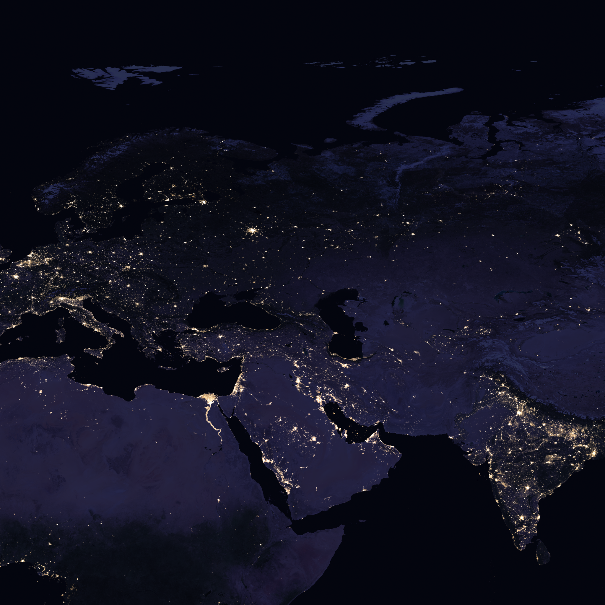
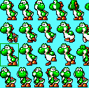
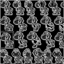

# ParallelizedSobel
This is a repository containing code for a parallelized Sobel algorithm that utilizes MPI and CUDA function calls. This program is meant to run on Power9 system architecture.

**PARALLEL SOBEL BOUNDARY DETECTION**

                                                                                                                      
                                                                                                                                                   

                                                                                                                      
                                                                                                                                                   

This is a program that runs the Sobel boundary detection algorithm using MPI, MPI_IO, and CUDA functions.

Sobel.c contains all MPI code and the main function.

Sobel.cu contains Cuda implementation.

pixel.h contains 2 datatypes that are used in both Sobel.c and Sobel.cu

There is a Makefile included that will compile all 3 of these files into a simple binary.

There are also 4 sbatch scripts that cumulatively test strong and weak scaling using the BlackMarble 2016 photograph.

The photograph used for testing can be found here: https://svs.gsfc.nasa.gov/30876

The files used for testing are much too large for upload to GitHub, but output images will be present within the write-up.

**To run the binary, the parameters look something like:**

mpirun -np RANKS ./Sobel-mpi-multi-gpu WIDTH HEIGHT input-filename output-filename

Be wary that photographs must be in a .data (byte) format.

Use an RGB file where each color value is a byte and ordered contiguously. GIMP is recommended for this, but not entirely necessary.

The output-filename is whatever you choose to name your output file.

This output file will be a grayscale representation of the calculated Sobel valued pixels. Thus, it will outline any boundaries found within the input photograph.

To view your output file GIMP is again recommended. It will ask for various specifications:
- Make sure your height and width is set to the same height and width of your input file
- Offset must be 0
- Image Type should be Gray 32-bit Float

It is also recommended to go into GIMP color>Auto>Stretch Contrast for better viewing

These are all testing scenarios present within the sbatch scripts.

**Strong Scaling:**

BlackMarble_2016_C1_18432x18432 1 ranks 1 node

Total Runtime: 8.726945 seconds

Cuda Runtime: 5.348938 seconds

------------------------------

BlackMarble_2016_C1_18432x18432 2 ranks 1 node

Total Runtime: 5.795312 seconds

Cuda Runtime: 2.884574 seconds

------------------------------

BlackMarble_2016_C1_18432x18432 4 ranks 1 node

Total Runtime: 3.791389 seconds

Cuda Runtime: 1.432372 seconds

------------------------------

BlackMarble_2016_C1_18432x18432 8 ranks 2 node

Total Runtime: 4.009085 seconds

Cuda Runtime: 0.745842 seconds

------------------------------

BlackMarble_2016_C1_18432x18432 16 ranks 3 node

Total Runtime: 4.296658 seconds

Cuda Runtime: 0.469719 seconds

------------------------------

BlackMarble_2016_C1_18432x18432 32 ranks 6 node

Total Runtime: 3.910650 seconds

Cuda Runtime: 0.285459 seconds

------------------------------

**Weak Scaling:**

BlackMarble_2016_Full_11585x11585 1 ranks 1 node

Total Runtime: 3.669618 seconds

Cuda Runtime: 2.245136 second

------------------------------

BlackMarble_2016_Full_16384x16384 2 ranks 1 node

Total Runtime: 4.811697 seconds

Cuda Runtime: 2.360394 seconds

------------------------------

BlackMarble_2016_Full_23170x23170 4 ranks 1 node

Total Runtime: 7.116398 seconds

Cuda Runtime: 1.920250 seconds

------------------------------

BlackMarble_2016_Full_32768x32768 8 ranks 2 nodes

Total Runtime: 11.498551 seconds

Cuda Runtime: 1.904782 seconds

------------------------------

BlackMarble_2016_Full_46341x46341 16 ranks 3 nodes

Total Runtime: 23.138975 seconds

Cuda Runtime: 2.169928

------------------------------

